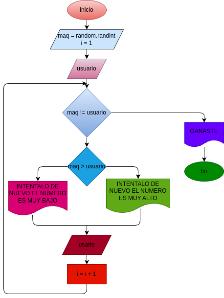

# juego_n_2
juego n 2

# Analisis

## Input

usuario
i

### Variables de entrada

### processing

usuario < 1 or usuario > 100:
maq != usuario:
i = i +1

### output
S= (n*(n+1))/2
# Diseño

# Construcion 
